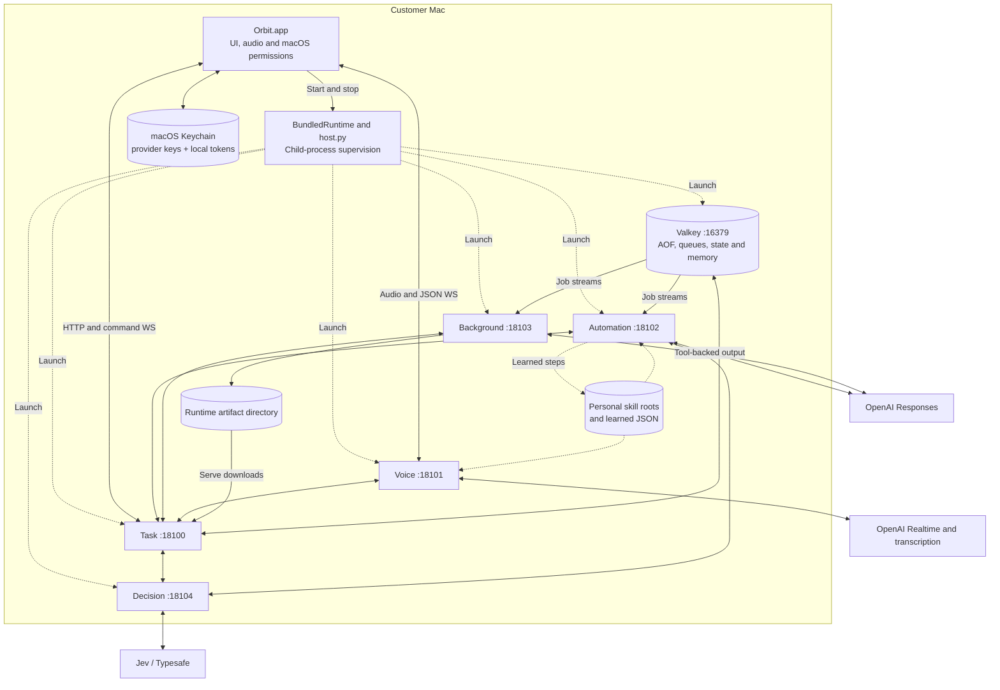
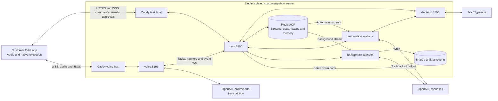
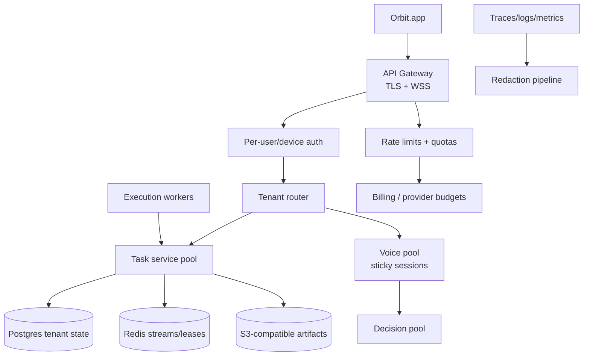

# Orbit Deployment Runbook

This runbook covers the production-oriented deployment path for Orbit. macOS authority remains in the native app, while server deployment is used only for isolated backend stacks or tightly controlled beta cohorts. Developer ID signing and notarization remain release requirements.

## Production Readiness Boundary

Orbit can be prepared for a 100-customer BYOK beta with the files in this repository, but it is not yet a shared multi-tenant SaaS backend.

Required before a broad paid launch:

- Developer ID signed, hardened, notarized and stapled macOS app.
- Live acceptance for wake, voice, goal execution, outcome verification, approvals, Stop/Goodbye, lock/sleep, physical takeover and revoked permissions.
- Per-user auth, tenant isolation, quotas, artifact ownership, rate limits and data-deletion APIs before one shared backend serves unrelated customers.
- Provider budget controls and support processes.
- Crash/diagnostic intake that redacts secrets, screenshots, raw audio and private task data.

The recommended v1 deployment is either:

- **Bundled local mode:** each customer runs the native app and local services on their Mac.
- **Isolated server mode:** each customer or beta cohort gets its own backend stack, tokens, Redis and artifact volume.

## Deployment Architecture

Checked against source on **2026-10-05**. The [README architecture](README.md#architecture) covers model roles, ready-context speech, goal coordination and action execution. The diagrams below use functional role names for the general desk agent and show where the current components run. Existing module/container identifiers remain in runnable commands; the bounded generic goal graph is implemented, with live acceptance still pending. These diagrams do not establish live readiness or capacity for 100 customers.

| Launch path | Network boundary | Legacy Jev routing default | Skill access |
|---|---|---|---|
| Bundled app: `BundledRuntime.swift` → `scripts/host.py` | Five local Python processes on loopback `18100–18104`; bundled Valkey on `16379` | Host sets `off`; generic goal submission remains enabled | Host supplies existing personal skill roots plus the local learned-skill directory |
| Local Docker: `compose.yaml` | Only task `8100` and voice `8101` published on loopback; remaining ports internal | `shadow`, empty capability allowlist, unless overridden | No personal directories mounted by default; configured roots need explicit mounts |
| Isolated server: `compose.prod.yaml` | Caddy publishes `80/443`; task, voice, decision, workers and Redis stay on the backend network | `shadow`, empty capability allowlist, unless overridden | No skill mounts; learned-skill persistence disabled in the template |

The direct developer runner, `scripts/run.py`, starts independent Python processes using normal runtime configuration and requires Redis separately; `compose.direct.yaml` exposes Redis on loopback for that path. These defaults are from source, not inspected live credentials or configuration.

### Bundled Local Mode



`BundledRuntime` reads provider keys and the device/service tokens from Keychain, then passes them to `host.py` through its process environment. The host sends the OpenAI key only to the voice gateway and execution workers, and the Typesafe key only to the decision service. Both broker tokens are supplied to the services. The native device token and loopback URLs are written to `~/Library/Application Support/Orbit/config.json` with mode `0600`; provider keys are not written there.

Valkey AOF, generated artifacts and service logs live under `~/Library/Application Support/Orbit/runtime`. Learned JSON lives under `~/Library/Application Support/Orbit/learned-skills`. The host discovers existing `.codex/skills`, `.claude/skills`, `.agents/skills` and `.claude/plugins` directories without copying them into the repository. Voice and automation build their skill indexes at startup.

This mode uses no Orbit-operated backend server, but still calls external providers: audio/transcripts go to OpenAI, decision text goes to Typesafe, and the generic visual agent (or legacy visual fallback) sends screenshots to OpenAI. Relevant memory context and selected skill text can also enter model prompts. Local services do not make inference offline.

### Isolated Server Mode



Task and voice are separate TLS hosts on the same Caddy instance. The task host must support WebSockets as well as HTTP: native commands, confirmations and results use that connection. Voice also subscribes to the task service's internal event WebSocket; a reconnect begins with authoritative task and follow-up snapshots.

Workers consume Redis jobs directly, but task authority owns claims, leases, action validation and result state. Native-action waits use Redis Pub/Sub after subscribing before dispatch. Screenshots and Accessibility snapshots travel transiently through that server path; only ordinary results can be recovered from stored action state.

Use this only when every user on that stack is expected to trust the same backend deployment. Memory keys are deployment-wide, artifact access uses the shared device credential, and all workers share one service credential. Do not put unrelated customers behind one token pair. Per-customer provider billing is not implemented for a shared cohort stack.

### Future Shared SaaS Target



This future target is **not implemented**. Postgres, object storage, tenant routing, per-user auth, quotas and billing need code changes outside the current deployment files. Existing Redis memory and local skill files do not supply those ownership boundaries.

## Files

- `compose.prod.yaml`: production-oriented server Compose stack.
- `deploy/Caddyfile`: TLS ingress for task and voice endpoints.
- `.env.prod.example`: production environment template.
- `docker-bake.prod.hcl`: registry-tagged multi-architecture image build.
- `Dockerfile`: common service image recipe.
- `scripts/smoke.py`: real broker/worker smoke tests with fake native device.
- `scripts/check_release.py`: release hygiene scan.

## Server Prerequisites

- Linux VM with Docker Engine and Compose plugin.
- Public DNS names for task and voice hosts.
- Inbound TCP 80 and 443 open for Caddy/ACME.
- 2 vCPU and 4 GB RAM minimum for a small isolated stack.
- 4 vCPU and 8 GB RAM recommended for a 100-customer BYOK beta cohort with light concurrent use.
- Disk with encrypted volume if storing task artifacts or Redis AOF.

## Build And Push Images

Set registry variables locally:

```sh
REGISTRY=ghcr.io/your-org VERSION=0.1.0 docker buildx bake -f docker-bake.prod.hcl --push
```

For local validation without push:

```sh
docker buildx bake --load
```

## Configure Server Environment

On the server:

```sh
cp .env.prod.example .env.prod
```

Edit `.env.prod`:

- `ORBIT_REGISTRY`
- `ORBIT_IMAGE_TAG`
- `ORBIT_TASK_HOST`
- `ORBIT_VOICE_HOST`
- `ACME_EMAIL`
- `ORBIT_DEVICE_TOKEN`
- `ORBIT_SERVICE_TOKEN`
- `OPENAI_API_KEY`
- `TYPESAFE_API_KEY` if Jev is enabled

Generate tokens:

```sh
python3 - <<'PY'
import secrets
print('ORBIT_DEVICE_TOKEN=' + secrets.token_urlsafe(40))
print('ORBIT_SERVICE_TOKEN=' + secrets.token_urlsafe(40))
PY
```

The voice gateway now submits generic goals independently of legacy Jev routing flags. The bundled host disables legacy voice routing. Jev remains optional for task-authority advisory risk assessment, with a 400 ms deadline and no permission bypass. Server `ORBIT_JEV_MODE`/capability settings affect compatibility paths; they are not the generic-goal activation switch. Native and task services must be upgraded together for goal statuses and follow-up events.

## Start The Server Stack

```sh
docker compose --env-file .env.prod -f compose.prod.yaml pull
docker compose --env-file .env.prod -f compose.prod.yaml up -d
docker compose --env-file .env.prod -f compose.prod.yaml ps
```

Check public endpoints:

```sh
curl -fsS https://api.orbit.example.com/healthz
curl -fsS https://api.orbit.example.com/readyz
curl -fsS https://voice.orbit.example.com/healthz
curl -fsS https://voice.orbit.example.com/readyz
```

Native remote config must use TLS:

```json
{
  "ORBIT_DEVICE_TOKEN": "customer-or-cohort-token",
  "ORBIT_TASK_URL": "https://api.orbit.example.com",
  "ORBIT_VOICE_URL": "wss://voice.orbit.example.com"
}
```

## Scaling For 100 BYOK Beta Customers

Single-server replica layout to load-test before using with a beta cohort:

```sh
docker compose --env-file .env.prod -f compose.prod.yaml up -d \
  --scale voice=3 \
  --scale automation=4 \
  --scale research=2 \
  --scale decision=2
```

Notes:

- A live WebSocket voice conversation is tied to one voice replica. Put a WebSocket-aware proxy or sticky routing in front of multiple servers.
- Memory and task state are shared within a deployment; replicas do not create customer isolation. This layout and the sizing guidance above have not established 100-customer capacity.
- Execution workers scale horizontally on Redis Streams, but desktop automation is still leased per device.
- Artifact storage is a local Docker volume in this template. Do not deploy across multiple hosts until artifacts move to S3-compatible storage.
- Redis is a single container in this template. Use managed Redis or a dedicated Redis host before claiming HA.
- No provider cost guardrail exists in the app. Use provider project budgets and manual usage review.

## Smoke Tests

Automated no-provider broker smoke:

```sh
docker compose stop automation research
.venv/bin/python scripts/smoke.py
docker compose up -d automation research
```

Two-worker handoff smoke:

```sh
docker compose up -d --scale automation=2 --scale research=1
.venv/bin/python scripts/smoke.py --workers
docker compose up -d --scale automation=1
```

Production server smoke against TLS endpoints requires `.env` or local environment to point `ORBIT_TASK_URL` to the public task host and to contain the deployment token. Do not print those values.

## Release Checklist

Before a public binary release:

1. Run `python3 scripts/check_release.py`.
2. Run `uv run pytest`.
3. Run `uv run ruff check shared services tests scripts`.
4. Run `bash native/check.sh`.
5. Build the native app from a clean checkout.
6. Sign with Apple Developer ID using hardened runtime.
7. Notarize and staple the app/DMG.
8. Generate checksums for release artifacts.
9. Verify install from the downloaded DMG on a clean macOS user account.
10. Run preview states and the guided live acceptance sheet.

## Operational Runbook

### Logs

```sh
docker compose --env-file .env.prod -f compose.prod.yaml logs --since=1h task voice automation research decision
```

Never paste logs containing credentials, raw provider payloads, screenshots, transcripts, customer task goals or private document names into public issues.

### Backup

Back up:

- Redis AOF volume, including the persistent memory and follow-up records.
- Artifact volume.
- `.env.prod` in a secrets manager, not Git.
- Caddy data volume if preserving ACME certificates.

For bundled installations, include runtime data and learned skills in any user-authorized backup. Redis task/action/artifact metadata normally expires after 24 hours; memory records have no per-record TTL and are capped at 200 entries. Artifact files and native downloaded copies have a separate filesystem lifecycle, so deleting Redis metadata does not delete those files.

### Rollback

Set `ORBIT_IMAGE_TAG` in `.env.prod` to the previous release tag and run:

```sh
docker compose --env-file .env.prod -f compose.prod.yaml pull
docker compose --env-file .env.prod -f compose.prod.yaml up -d
```

### Data Deletion

For isolated stacks, stop the stack and remove volumes only after customer confirmation:

```sh
docker compose --env-file .env.prod -f compose.prod.yaml down -v
```

For bundled local mode, users should remove:

- `~/Library/Application Support/Orbit`
- `~/Documents/Orbit`
- Orbit Keychain items
- the app bundle

## Current Production Gaps

- No shared multi-tenant auth or tenant database.
- No S3 artifact adapter.
- No centralized billing/quota/rate-limit system.
- No automated notarized release workflow.
- No crash/diagnostic upload pipeline.
- No live acceptance evidence for production claims.
- Browser-specific Playwright/CDP lane is still a roadmap item.


## Voice-first beta release and proactive schedules

Follow-up rules and request identities persist in Redis with no per-record TTL. Back up/delete the follow-up namespace with the deployment's user data. The scheduler is owned by task authority and runs while that service is up; reminders require native confirmation and never authorize jobs. Quiet hours are 22:00–08:00 in each rule timezone. Spoken reminders require an awake client. This is not an OS background notification service.

Use `scripts/release_mac.py --app dist/Orbit.app --identity "Developer ID Application: YOUR IDENTITY" --version 0.2.0 --notary-profile YOUR_PROFILE` after assembling the runtime and configuring your own Developer ID/notarytool profile. The script rejects ad-hoc identities, signs the nested runtime, notarizes/staples and writes a versioned DMG. Do not use that command until the account and profile are ready. Notarization has not been exercised in this iteration. Test hardened-runtime permissions, Keychain continuity, launch and rollback on separate Macs before distribution.

For paid validation, reserve a conservative estimate first: `python scripts/validation_budget.py --id trial-001 --reserve-inr 250 -- .venv/bin/python scripts/benchmark_voice.py --limit 30`. Reservations survive failed runs. Reconcile actual usage explicitly using the ledger before further runs; the ₹4,500 reservation ceiling leaves ₹500 within the development budget for reconciliation. This does not enforce customer/provider billing caps.

Keep the last accepted version for manual rollback. Do not replace a running app. The beta targets Apple Silicon/macOS 26; native CI uses that OS family. Cua evaluation and tester gates remain pending.

Local validation on 2026-10-05 passed 191 Python and 51 native tests plus a five-service, two-worker bundled smoke using dummy credentials. A subsequent authorized live pass built all five images, passed broker/two-worker smoke and left all six containers healthy. The initial sandbox socket denial was not a daemon outage. Both Compose templates now explicitly route task risk requests to `http://decision:8104`; HTTP 200 was verified from the running task container. The local beta image remains ad-hoc signed and unnotarized.
