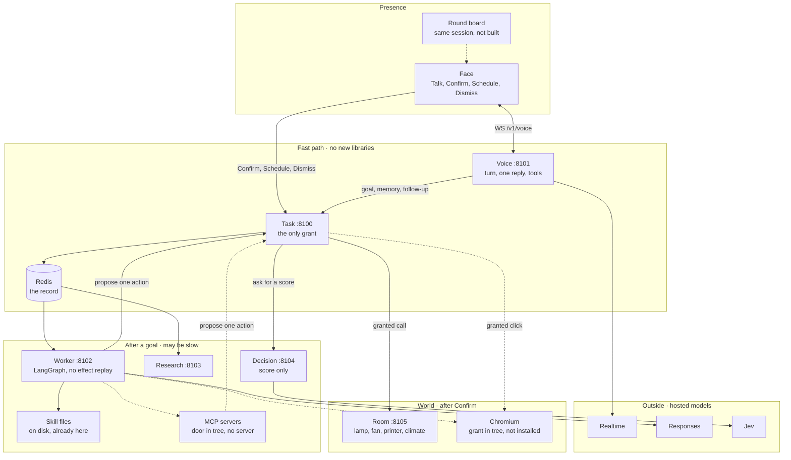

# Orbit

Orbit is a voice-first general agent for your desk. It talks, remembers, and follows through on a plan you accept. The live client is a browser face. A round board is the same session and is not built. That board is presence: speech, state, and a separate grant. A Linux host runs the services. Room devices that speak local HTTP are one capability behind task authority. They are not the job. Applications are capabilities, not product boundaries.

## Production Status

**Private-beta implementation; live acceptance is still pending.** English, including Indian-accented English, is the current language scope. The services are bring-your-own-key and run on Linux. The cheap client is a browser face on the task service. The round board is not built yet. The Mac app remains in the tree from the previous cut and is not required here. General scope does not imply every device or request works today.

## Architecture

Target, accepted 2026-10-06. The rules are in [ARCHITECTURE.md](ARCHITECTURE.md). The lesson page is [architecture.html](architecture.html). The pressures are in [Design choices](#design-choices). The page grant is in the tree. Chromium is not installed. The running host is still voice 8101, task 8100 with `GET /face`, worker 8102, research 8103, decision 8104, room 8105, and Redis.

Orbit is a desk friend. The face is presence. The round board is the same session and is not built. The Linux host runs the services and is not a shell. Room HTTP is one capability. An isolated browser is a second capability. Neither is the job.

The fast path is in-process. Confirm, the action id, the lease, the epoch, and the face ping do not wait on a new library. Speech models, research, and the browser sit off that path. Spoken or typed yes is conversation.



A solid line is a call the host makes today. A dotted line is in the tree and is not a live call yet. The browser arrow leaves Task, not the model. The worker may ask for the next look. It may not click.

| Path | What runs | New libraries |
|---|---|---|
| Fast, internal | Face, `WS /v1/voice`, Redis, Confirm, Schedule, epoch, ping | None. FastAPI, redis-py, websockets, Pydantic |
| Slow, already here | Realtime, Responses, Jev, research PDF, LangGraph | None |
| Slow, after Confirm | Empty Chromium | One: Playwright, on the task process |

### Plumbing

| Job | Library | On the fast path? |
|---|---|---|
| HTTP and sockets | FastAPI, Starlette, Uvicorn, HTTPX, websockets | Yes |
| Record and queues | Redis image, redis-py | Yes |
| Request shapes | Pydantic | Yes |
| Observe, act, verify | LangGraph | No |
| Research files | pypdf, ReportLab | No |
| Page snapshot and click | [microsoft/playwright-python](https://github.com/microsoft/playwright-python) | Yes. Task image only; grant stays on Confirm |

Do not add Pipecat, Letta, Browser Use, Stagehand, Hermes, OpenClaw, or DeepSeek Harness. Each one is a second runtime or a second owner of the grant. Hermes can embed as `AIAgent`. We do not, because its default tool is a host shell.

### When another harness ships a feature

Orbit does not track their release notes by rewriting their product. A new feature enters through one of three doors. If it does not fit a door, it stays theirs.

| Door | What may enter | What must still be true |
|---|---|---|
| Skill file | A procedure another project already wrote. Disk skills exist today | The file does not run a shell. A world change still becomes an action id |
| MCP server | A connector they ship next: mail, calendar, files, search. The door is in the tree. No server is configured | The server proposes. Task grants. A write needs Confirm. A read is an observation with an action id |
| Worker library | A thinner hand for a world we already named. Playwright is the only one accepted | It is not on the fast path. It does not own the grant |

Refuse these even if they are the headline of a release: a host shell, auto-approve, chat-channel presence, a second voice runtime, a checkpoint that replays a click, and a memory store that replaces Redis on the talk path.

What is already covered, so a new release does not force a rewrite: one audible reply, epoch, Confirm, Schedule, quiet hours, bounded memory tools, cited research, advisory score, and room HTTP.

What is still open, on purpose: install Chromium, configure an MCP server, semantic memory, and a wake while the face is asleep. The last one stays closed until the face can show a card. A Telegram bot would be a second presence.

### Browser

The face tab is not the work browser. The work browser is an empty Chromium with a domain allowlist. It is not the person's Chrome. Page text is untrusted.

Checked 2026-10-06. [browser-use/browser-use](https://github.com/browser-use/browser-use) is MIT and is a second agent loop, so it is not used. [browserbase/stagehand](https://github.com/browserbase/stagehand) waits until a flow repeats and should stop calling a model. [Skyvern-AI/skyvern](https://github.com/Skyvern-AI/skyvern) is AGPL-3.0 and is out. Playwright MCP is a coding-agent server and is out. The library is in. Claude in Chrome would inherit the daily session and is out.

A page read is an observation. It still has an action id, so a retry cannot double-act. A click, a type, a submit, a purchase, a message, or a new origin needs Confirm. The card shows the URL, the action, and the target. After a crash, the next attempt reads the page again. It does not replay a click.

### Pieces

| Piece | Where it runs | What it owns | Where it stops |
|---|---|---|---|
| Browser face | The browser. The task process only serves the page | Talk, Confirm, Schedule, Dismiss, playback, the task list, file download | Talk sends a sentence. Confirm grants one payload. Schedule activates one follow-up. Dismiss closes one due reminder |
| Round board | Not built | The same two sockets: speech, and the grant | Same stop as the face. It is presence only |
| Turn and epoch | Voice | The current turn. A new sentence ends the old turn | An old reply loses the speaker |
| One audible reply | Voice | The accepted reply's audio, and the clear when a new sentence arrives | A second reply stays silent |
| Tool calls | Voice | `submit_task`, `follow_up`, `save_memory`, `forget_memory`, `recall_memory`, `session_control` | A tool result is acceptance or a proposal. It is not a grant and it is not completion |
| Engagement | Voice | When a progress line may be spoken | It waits while you speak, and while a reply is still playing |
| Session socket | Task | The device session, the one-time face ticket, the connection lease | A second connection replaces the first. The socket is not a second authority |
| Authority | Task | The task, the action id, the lease, the fence, the confirm | This is the only grant. Spoken yes stops here |
| Memory store | Task | A bounded list of sentences for this deployment | A memory does not start a job |
| Follow-up scheduler | Task | Proposal, the Schedule confirm, quiet hours 22:00–08:00, the due id | A due item is a prompt on the face. It does not start a room call or a desktop job |
| Worker | Its own process, port 8102 | Observe, act through authority, read again, verify. Bounded steps. One https address asks for a page read | It does not call the world on its own. It does not click |
| Research | Its own process, port 8103 | A cited file, then the record of that file | It does not grant |
| Decision | Its own process, port 8104 | An advisory score | A score does not grant. A timeout stays unknown |
| Redis | Beside the services | The record, the leases, and the queues | It stores state. It does not choose |
| Realtime | Outside the harness | Speech in and speech out | It does not grant |
| Responses | Outside the harness | A plan for the worker, or a research draft | It does not grant |
| Jev | Outside the harness | The risk score Decision asked for | It does not grant |
| Room | Its own process, port 8105 | Lamp, fan, printer, and a climate reading. A stand-in capability | Task calls it after Confirm |
| Browser | Grant path is in the tree. Chromium is not installed | Open a page, read it, click or type after Confirm | Empty profile. Domain allowlist. The call runs in the task process. Not the face tab |
| Skill files | Disk, already in the worker | A named procedure for one goal | The file does not grant and does not get a shell |
| MCP door | In the tree. No server is configured | Import a connector from another harness | The server proposes. Task is the only caller of the world |
| Desktop | Previous Mac client, still in the tree | Screenshots and Accessibility on that client | This face answers "This client has no desktop." The record still exists |

### Open source in this tree

These are the repositories the services import or run today. OpenAI Realtime, OpenAI Responses, and Jev are hosted models. They are not in this list. The Mac app has no third-party Swift packages. `scripts/jev_laya_examples.py` asks the same decision questions to local Laya. That sample loads [convaiinnovations/laya](https://huggingface.co/convaiinnovations/laya) from Hugging Face. The services do not import it.

The target adds one worker library on the task process: [microsoft/playwright-python](https://github.com/microsoft/playwright-python). Pipecat, Letta, and Browser Use stay out.

| Repository | Used for | Harness piece |
|---|---|---|
| [python/cpython](https://github.com/python/cpython) | Language runtime. The service image is `python:3.13.11-slim-bookworm` | Every Python process |
| [fastapi/fastapi](https://github.com/fastapi/fastapi) | HTTP and WebSocket app, MIT | Voice, task, worker, research, decision, room |
| [encode/starlette](https://github.com/encode/starlette) | The toolkit under FastAPI, BSD | Same processes |
| [encode/uvicorn](https://github.com/encode/uvicorn) | The process that serves each app, BSD | `scripts/serve.py` |
| [encode/httpx](https://github.com/encode/httpx) | Calls from one service to another, and to model hosts, BSD | Voice, task, worker, research, decision |
| [encode/anyio](https://github.com/encode/anyio) | Structured async tasks, MIT | Task |
| [pydantic/pydantic](https://github.com/pydantic/pydantic) | Request and record shapes, MIT | Shared contracts, task, decision, room |
| [redis/redis-py](https://github.com/redis/redis-py) | Redis protocol client, MIT | Voice, task, worker |
| [python-websockets/websockets](https://github.com/python-websockets/websockets) | Voice socket to the speech host, and voice listening to task, BSD | Voice |
| [langchain-ai/langgraph](https://github.com/langchain-ai/langgraph) | The bounded observe, act, verify graph, MIT | Worker |
| [py-pdf/pypdf](https://github.com/py-pdf/pypdf) | Read the research PDF after it is written, BSD | Research |
| [reportlab/reportlab](https://github.com/reportlab/reportlab) | Write that PDF, BSD | Research |
| [redis/redis](https://github.com/redis/redis) | The store image `redis:7.4.6-alpine` | The record |

The store image is source-available under the Redis Source Available License and the Server Side Public License. It is not an OSI-approved open-source license. The Python client is MIT, and it speaks the same protocol as [valkey-io/valkey](https://github.com/valkey-io/valkey), which is BSD. This tree pins the Redis image. It does not pin a Valkey image.

Tests and local checks use [pytest-dev/pytest](https://github.com/pytest-dev/pytest), [pytest-dev/pytest-asyncio](https://github.com/pytest-dev/pytest-asyncio), [cunla/fakeredis](https://github.com/cunla/fakeredis), and [astral-sh/ruff](https://github.com/astral-sh/ruff). Those do not ship in the service image.

The service ports are 8100–8105, with the Redis image beside them. A bundled Mac build publishes 18100–18104 and 16379; that bundle is the previous client. Credentials for this cut stay in the host environment. Never put them in an image or in gadget firmware.

### The face

The live client is the browser page at `GET /face`. It is one `device_id` on `WS /v1/voice`: PCM16, mono, 24 kHz, both ways. Talk sends a sentence. Confirm grants one payload. Schedule activates one follow-up. Dismiss closes one due reminder. A spoken yes is conversation.

The round board is the same session and is not built. No firmware is in this tree. The services stay on the Linux host. The host is not a shell. Room HTTP and the page grant are capabilities. A lamp cannot show a payload, so a lamp is not this client.

### Voice, context and engagement

The gateway requests a response after audio is committed; finalized transcription and memory retrieval no longer gate ordinary speech. Available preferences/context are injected at a safe response boundary. `recall_memory` retrieves missing personal facts before an answer; `save_memory` and `forget_memory` support conversation-based memory control. Memory remains a bounded deployment-wide store, not a multi-user memory system.

Speech and execution are independent. `submit_task` creates one generic goal per turn with constraints and completion criteria. Repeated tool calls reuse the accepted task. Old generations and stale turns cannot start new work. Replies and announcements carry an input epoch to reject late speech after a newer turn.

Engagement comes from truthful state: listening, speaking, working, approval, outcome. Visual task state remains available while listening. Routine spoken progress waits four seconds initially and at least 15 seconds between meaningful updates. Outcomes and required decisions have priority but wait for a conversational gap and client playback to finish. “Less commentary” suppresses routine updates. Reconnect snapshots recover state without replaying old task announcements.

### Goals, evidence and permissions

The new `goal` kind carries `constraints` and `completion_criteria`; legacy task kinds remain supported. The graph has a configurable, capped step budget and no persistent checkpoints that can replay an effect. Today the effect is a room call or a local HTTP call, and the fresh observation is a new reading from that device. The screenshot and Accessibility adapters still in the tree belong to the previous Mac client. A page read and a page click go through the same grant as the lamp. Chromium is not installed, so a page call fails closed until that library is on the task image.

Each action goes through task authority. The graph reads the device again after delivery and can return `completed`, `partial`, `blocked` or `failed`. Completed generic goals require that reading. A model's interpretation of it is not a guarantee of correctness; held-out live trials remain required.

Jev assesses proposed effects within 400 ms and cannot grant consent. Timeout or a malformed result becomes unknown. The face's Confirm control authorizes one exact payload. Spoken "yes" does not. Jev is optional at startup and is outside the speech critical path. Legacy Jev voice-routing flags do not disable generic goal submission.

Configured model defaults remain `gpt-realtime-2.1-mini`, `gpt-4o-transcribe`, `gpt-5.6-sol`, and `jev-1.13.0`. This iteration did not call live providers or establish model quality/latency.

### Proactive follow-ups

Conversation and remembered intentions can suggest reminders. The `follow_up` tool lists, proposes, edits, cancels and dismisses them. Review the exact text, time, timezone and recurrence on the browser face and choose **Schedule** there. The future round board uses the same control. Creating or editing a proposal alone does not activate it. Jev does not authorize scheduling. The previous Mac client still presents this confirmation on its glass. This cut uses Schedule on the face.

Schedules persist in Redis across voice sessions. Supported recurrence is once, daily or weekly; quiet hours are 22:00–08:00 in the specified IANA timezone. A 15-second backend timer publishes due prompts with stable delivery identities. Publication and mutations are coordinated; reconnect restores pending reminders. Dismissal propagates to both voice and native UI. Missed recurring occurrences coalesce rather than generating a backlog.

Follow-ups prompt the user. They do not create room jobs by themselves. Stop or Goodbye stops the current interaction and leaves confirmed reminders in place. The host must be running, and spoken delivery waits until the face session is awake. There is no operating-system notification and no cloud wake while the session is asleep. One-time blanket opt-in for inferred nudges is not implemented.

### Source map

- [Voice coordination](services/voice/orbit_voice/app.py), [tools](services/voice/orbit_voice/protocol.py), [engagement policy](services/voice/orbit_voice/events.py)
- [Goal graph](services/automation/orbit_automation/goal.py), [room goals](services/automation/orbit_automation/room.py), [page read](services/automation/orbit_automation/browser.py), [task contracts](shared/orbit_common/contracts.py), [authority](services/task/orbit_task/store.py)
- [Host effects](shared/orbit_common/effects.py), [page](shared/orbit_common/page.py), [MCP door](shared/orbit_common/mcp_door.py). Chromium installs with the task image. No Pipecat, Letta, or Hermes on the talk path
- [Browser face](services/task/orbit_task/face.html), [room service](services/room/orbit_room/app.py), [device names](shared/orbit_common/room_devices.py)
- [Risk assessment](services/task/orbit_task/actions.py), [action policy](services/task/orbit_task/policy.py), [scheduler](services/task/orbit_task/followups.py)
- [Native presentation](native/Sources/OrbitApp/OrbitModel.swift) is the previous Mac client and is outside this cut. [Release workflow](scripts/release_mac.py). [Validation budget](scripts/validation_budget.py).

## Design choices

Read this after the diagram. Each subsection is one system-design decision: the pressure that forced a cut, the structure we used, and the cost we accepted. The costs are the limits of this beta, not a promise to remove them later. The [Architecture](#architecture) section is the target. Chromium is not installed, so these costs still describe the running host.

A desk agent does two kinds of work. Conversation must be short and interruptible. An effect must be recorded, owned by one component, and granted by something other than the model. Orbit puts those in different processes and lets them meet only at task authority.

### Conversation stays ahead of effects

The person hears a pause long before a device action is finished. The voice gateway therefore starts speech from committed audio and whatever context is already ready. Memory lookup and goal execution continue beside that reply. One turn submits one goal, and a later turn carries an input epoch so a late reply from the old turn is dropped.

The cost is that the first sentence can be ahead of the facts. A slow memory result is applied at the next safe boundary, and spoken progress has to wait so the agent does not narrate a stale task. Speech and the worker are two clocks. The epoch is the agreement between them.

### The face holds the senses

The previous client put the microphone, the speaker, the approval glass, and the desktop click in one Mac app. This cut uses the browser page for speech and for Confirm. The five services and Redis stay on a Linux host. The host is a machine on the network. The agent is not given a shell on it. Provider keys stay in the host environment. The round board, when it exists, uses the same two sockets.

The cost is a page that can sleep, and a board that is not built. The Mac app is still in the repository. This cut does not build, sign, or require it. A goal that needs a desktop application has no computer on this face. The running world is the page plus local HTTP devices. An isolated browser is a second world, still behind Confirm. Chromium is not installed.

### One authority, replaceable workers

A retry, a second worker, and a reconnect will all try to do the work again. Firing the same relay twice is a failure. Losing it after a crash is a different failure. The task service is the single authority for sessions, tasks, actions, leases, approvals, memory, and follow-ups. A worker holds a lease and a fence. An action has an immutable id, and the same request id returns the original task. Redis stores that state and the queues, so another replica can take over when a lease expires. A device reading is handed to the waiting worker for that attempt. It is not kept as a standing permission.

The cost is that one Redis is the coordination point for the whole deployment. There is no per-user authentication or tenant isolation, so the shape fits a small bring-your-own-key cohort and fails a shared service for many strangers. Recovery may wait out a lease. It must not treat an action that already changed the screen as new work.

### Effects are not resumed from a checkpoint

An agent graph wants to save its place and continue. Continuing after a relay, a light, or a print would fire it again. The goal graph is bounded and keeps no checkpoint that can replay an effect. After a worker failure the next attempt has to read the device again. Idempotency lives on the operation: the same action id and the same payload are one action. The same id with a different payload is rejected.

The cost is discarded in-memory progress. The person may have to say the goal again. That is the cheaper failure.

### A goal is a contract, and completion needs a fresh look

A fixed catalog of tasks is easy to score and too small for a desk. An open prompt will also declare success because the model feels finished. A goal therefore carries constraints and completion criteria. The worker observes, acts only through authority, observes again, and verifies, inside a step cap. For this cut the observation is a fresh reading from the local HTTP device after the call. A completed generic goal must return that reading. The gate requires the new reading. It does not make the reading certainly true. Screenshot and Accessibility checks remain in the tree for the previous Mac client.

The cost is a smaller world. There is no desktop application to open and no pixels to interpret on this face, so a running goal is only as real as the device that reports back. The target adds a page snapshot as another fresh look. A device or a page can report success and still be wrong. Held-out trials on a live board are still the acceptance test, and they have not been run.

### A grant is a button for one payload

The shortest permission design asks "shall I?" and accepts "yes" in the same chat. The model is the component being limited, so a sentence it can emit is a weak grant. Consequential actions stop on a card built from the exact payload and drawn on the face. The person allows that payload with the on-screen confirm. Push-to-talk is a different control, so holding it to speak cannot authorize the effect. A spoken or typed yes is conversation. Jev may score the proposed effect inside a short deadline. A timeout is recorded as unknown. The score cannot grant, and it stays off the speech path so a slow judgment cannot hold up the voice.

The cost is that consent requires reading the card on the face. The boundary of "consequential" still has to be chosen, and a bad boundary either nags or skips a real grant. Jev is an extra provider whose judgment stays advisory until a measured evaluation says more.

### A reminder is a prompt

A desk agent should return to an intention. An agent that starts work from that memory will act while the person is away. A follow-up is proposed in conversation and becomes real when the person confirms the exact text, time, timezone, and recurrence on the face. Quiet hours hold delivery. The due item is a prompt with a stable id. It does not create a room job, and it waits until that session is awake.

The cost is no system notification and no wake from sleep. A missed occurrence folds into the next one instead of replaying a pile, so the moment can pass. Confirming each reminder is slower than one blanket opt-in, and much harder to trip by accident.

### One face is the whole client

Eight bodies plus a computer is a catalog. This cut keeps one session so the grant and the evidence path are designed once. That session is the browser page. It is the client, the speaker, and the approval surface. The round board joins the same session later. Local HTTP devices remain capabilities, and each effect is confirmed on this page. The Linux host runs the services and receives no shell.

The cost is everything the Mac used to reach: desktop applications, Accessibility, screenshots. The round board is not in the tree. The scarcer proof is still one spoken goal that comes back with a fresh reading.

### One deployment, bring your own key

Accounts, quotas, artifact ownership, and a hard billing limit are what a shared backend needs. Building them before one person can finish a goal inverts the order of risk. Each cohort runs its own stack and its own provider keys. Memory is a bounded store for that deployment. The validation ledger reserves an estimate on our side. It does not cap the provider invoice.

The cost is that memory inside a deployment is not private to one user, retrieval is not semantic, and a surprise bill is still possible. Those stand until the single-desk loop is accepted.

## Quickstart

Prerequisites for this cut:

- A Linux host for the services. macOS is not required.
- Python 3.13.
- Docker, with the engine running.
- OpenAI API key for conversation and model-backed execution.
- Optional Typesafe/Jev API key for advisory risk assessment.
- A browser for the face. The round board is later. No firmware is in this tree.

The previous Mac client still builds with Swift Command Line Tools or Xcode. This cut does not use that app.

Prepare local configuration:

```sh
python3 scripts/setup.py
# Edit .env locally. Never commit or paste credentials.
```

Run the services for this cut. Then open `http://127.0.0.1:8100/face`. Paste the device token. Press Talk. A written sentence goes to the voice model. An empty sentence uses the microphone until you release Talk. The model answers, and it may start a goal, a research report, a memory change, or a follow-up. Press Confirm for one action. Press Schedule for one proposed follow-up. Press Dismiss for one due reminder. A research file appears as a download on the page. A desktop action ends in the record, because this face has no Mac. The round board is still not in the tree.

```sh
docker compose up -d --build
```

The previous Mac client, unused by this cut:

```sh
uv sync --group dev
uv run playwright install chromium
uv run python scripts/build_mac.py
uv run python scripts/launch.py --preview
```

## Development Checks

```sh
uv sync --group dev
uv run playwright install chromium
uv run pytest -q
uv run ruff check shared services tests scripts
bash native/check.sh
```

Broker smoke with fake device, no provider calls and no real desktop actions:

```sh
docker compose stop automation research
uv run python scripts/smoke.py
docker compose up -d automation research
```

Two-worker handoff smoke:

```sh
docker compose up -d --scale automation=2 --scale research=1
uv run python scripts/smoke.py --workers
docker compose up -d --scale automation=1
```

## Deployment Files

- `DEPLOYMENT.md`: production, server, release, and operations runbook.
- `compose.yaml`: local development stack.
- `compose.direct.yaml`: exposes Redis on loopback for direct Python service development.
- `compose.prod.yaml`: isolated server deployment template with Caddy TLS ingress.
- `deploy/Caddyfile`: production reverse proxy template.
- `docker-bake.hcl`: local multi-service image build.
- `docker-bake.prod.hcl`: registry-tagged production image build.
- `.env.example`: local development environment template.
- `.env.prod.example`: production deployment environment template.

## General-Agent Plan

| Workstream | Status | Evidence or remaining gate |
|---|---|---|
| Ready-context speech and turn fencing | Implemented; offline verified | Committed audio, slow recall, stale response and interruption regression tests |
| Generic goal contracts and bounded graph | Implemented; offline verified | Idempotency, fresh observation, budget exhaustion, evidence and status tests |
| Engagement/presentation | Implemented; offline verified | Coalescing, quiet commentary, playback/user-speech gating and native state tests; acoustic/UI review pending |
| Advisory Jev risk and optional key | Implemented; offline verified | Provider/model checks, unknown fallback, immutable approval floor; live classification evaluation pending |
| Conversational proactive follow-ups | Implemented; offline verified | Consent, recurrence, quiet hours, stale edit/retry, cancellation, receipts and reconnect tests |
| Developer ID release | Tooling implemented; blocked on account setup | Developer ID identity and notarytool profile required; no notarized release claimed |
| Cua Driver evaluation | Pending | Existing native driver retained; no paired 20-goal trial or adoption claim |
| Browser face as the Orbit session | Implemented; offline verified | The face uses the voice gateway and the task socket. Talk, Confirm, Schedule, and Dismiss are different controls. The voice model owns the sentence. Research files, follow-ups, and confirmations return on that session. A desktop action on this face ends in the record. The round board is still not built |
| Playwright on the task process, grant stays fast | Library + Chromium on the task image; grant stays on Confirm | Empty Chromium after Confirm. Redis memory and the current voice socket stay. No Pipecat, Letta, or Hermes |
| Customer acceptance | Pending, previous cohort | 60 held-out goals and 30 audio fixtures still apply; the three-Mac session plan belonged to the previous client |

### Measured results and targets

- **2026-10-04 baseline:** 162 Python tests passed before this implementation.
- **2026-10-05:** 191 Python tests and 51 native XCTest tests passed; Ruff, release hygiene and whitespace checks passed. A rebuilt app started all five bundled services without a Jev key, and two real worker replicas passed simulated-device handoff, deduplication and cancellation checks using dummy credentials. No provider inference or real desktop action was exercised. The beta package is ad-hoc signed, not notarized. Docker runtime verification was subsequently completed in the live validation pass below. No live voice, latency, provider accuracy or user-retention result is implied.
- **2026-10-05 live validation:** all five Docker images built; six containers healthy; broker and two-worker integration checks passed. Fixed the task-to-decision Docker endpoint and verified HTTP 200 inside the task container. Backend regressions now total **193 passed**. Thirty live-provider English audio trials at medium endpointing returned first audio at **2.12 s median / 4.05 s p95**; these are received-audio component timings, not physical speaker latency or verified meaningful replies. The latency target is not met. The same 30 fixtures at high endpointing measured **2.10 s / 3.58 s**, with 22/24 command acceptances versus 23/24 at medium; keep medium because the small median gain does not establish an improvement without a correctness tradeoff. Four general-question turns over one persistent live Docker gateway session measured **1.79 s median** received audio; this small sample is not acoustic latency. Native acceptance is blocked at the visible beta setup window, awaiting user key entry and permissions; zero native goal trials have started.
- Warm meaningful audible response target: **800 ms median / 1.5 s p95**. Interruption target: **250 ms p95**. Filler does not count. Report cold wake and memory-dependent answers separately.
- The [60-goal evaluation manifest](evals/general_goals.json) is a draft requiring human label review before freezing. [Trial validation](scripts/check_beta.py) rejects missing trials, false success and unauthorized/duplicate effects; live trials remain pending.
- Goal gates: ≥90% verified completion on actionable held-out goals; ≥90% correct clarification/handoff otherwise; zero false completion claims, unapproved consequential actions or duplicate effects in the acceptance set.

### Known limitations

English only; network-dependent cloud inference; unmeasured real acoustic latency and echo cancellation. This cut has no Mac client: no desktop execution, Accessibility, or screenshot loop. The round-board firmware is specified and not implemented. The browser face is the session client for voice, tasks, research files, memory tools, and follow-ups. Talk sends typed text, or microphone audio while the sentence field is empty. Assistant speech plays in the browser. A desktop command from this face is refused after the task record exists. A page grant is in the tree. Chromium is not installed. Jev is text-only. Reconnect creates a fresh voice session; graph state does not resume effects after worker failure. Artifacts stay on local or shared disk. Auth, credentials and memory are single-deployment rather than tenant-isolated. Memories lack retention, ownership controls, and semantic retrieval. No enforced customer spending cap. Validation budgeting is a reservation estimate ledger, not a provider-side billing limit. No enclosure, movement, or offline inference exists.

The four-week launch target does not override acceptance gates. Keep the cohort small until evidence supports expansion.

## Release Boundary

Keep local/private:

- `.env`
- `.venv/`
- `var/`
- `dist/`
- `docs/` historical/internal notes
- generated apps/DMGs
- macOS Keychain entries
- personal skill/plugin directories

Before public binary releases, use pinned third-party runtimes, checksums, SBOM/third-party notices, Developer ID signing, notarization, and a rollback plan.

## Contributing And Security

See `CONTRIBUTING.md` and `SECURITY.md`.

Changes to desktop authority, screenshots, memory, provider calls, approvals, permissions, or deployment must include safety-focused tests and documentation updates.
